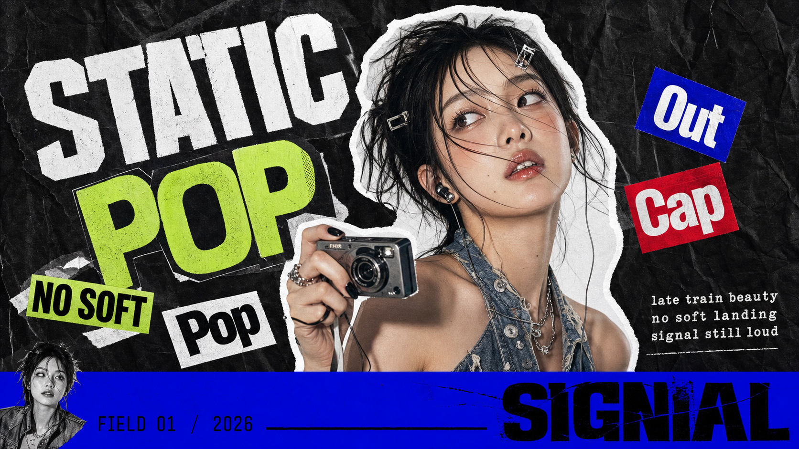
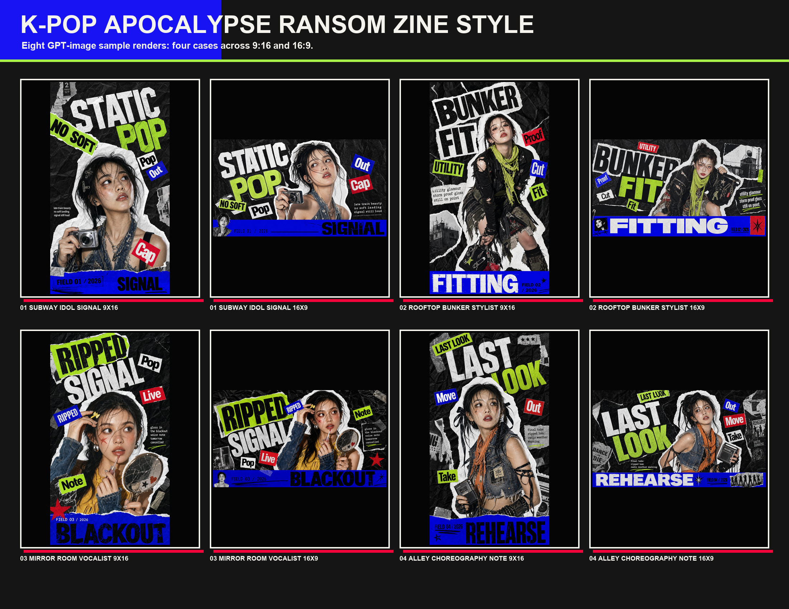

# Zine Deck Maker

A Codex Skill for turning a topic into a 7-8 page PDF zine deck using a loud K-pop apocalypse ransom-zine visual style.

The skill is optimized for visually driven PDF decks: short headlines, sparse captions, content-relevant cutouts, torn paper layouts, crumpled black texture, ransom-note typography, lime/blue/red accents, and bottom masthead strips.

## Style Reference

Single-slide reference:



Contact sheet:



The visual target is the reference style above: thick torn white paper borders, oversized distressed type, dense sticker collage, rough scan texture, and a saturated bottom masthead band. The main cutout should be chosen from the content; it does not have to be a person.

## What It Does

- Takes a user-provided topic, product, idea, trend, story, or campaign.
- Plans 7-8 pages as a `PPT 内容制作大师`.
- Writes short deck-ready Chinese or English copy depending on the user request.
- Generates a PDF-first visual deck in the bundled zine collage style.
- Requires a strong content-relevant cutout on each page; it can be a person, product, object, device, interface, receipt, package, scene fragment, or prop. Simple vector symbols and unrelated repeated people are not enough for this style.
- Avoids dense reports, clean corporate templates, watermarks, QR codes, copied logos, and exact source names.

## Install

Clone this repository into your Codex skills directory:

```bash
git clone https://github.com/YOUR_USERNAME/zine-deck-maker.git ~/.codex/skills/zine-deck-maker
```

Restart Codex or start a new session so the skill list refreshes.

## Usage

```text
使用 $zine-deck-maker，主题：后人类便利店，做 7 页，16:9，中文文案，输出 PDF。
```

```text
Use $zine-deck-maker. Topic: an AI music label. Make 8 pages, PDF output.
```

## Default Behavior

- Output: PDF
- Page count: 7-8 pages
- Copy depth: light planning
- Page content: headline, short caption, sticker words, visual direction
- Style source: `references/style-spec.json`

## Files

```text
SKILL.md
references/style-guide.md
references/style-spec.json
assets/01-subway-idol-signal-16x9.png
assets/style-contact-sheet.png
assets/*.png
agents/openai.yaml
```

## Notes

The bundled style spec is intentionally opinionated. It works best for music, youth culture, speculative futures, product concepts, campaign ideas, and editorial pitch decks that benefit from a chaotic poster-zine look.

## License

MIT
