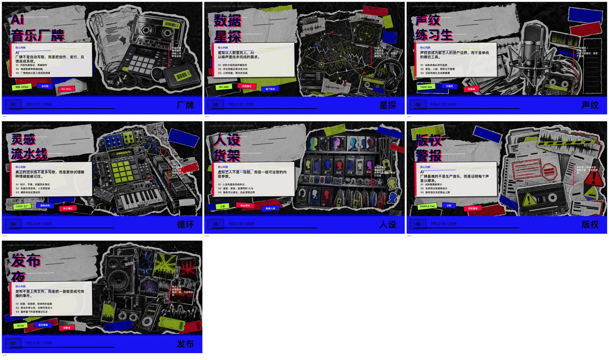

# Zine Deck Maker

A portable Agent Skill package for turning a topic into a 7-8 page PDF or slide deck using a loud K-pop apocalypse ransom-zine visual style.

It is not limited to Codex. The core workflow is platform-agnostic, and adapters are included for Codex, Claude Code, Cursor, ChatGPT, and generic agents.

## Preview

Style reference:


Contact sheet:


Example output preview:



## What It Does

- Takes a topic, product, idea, trend, story, or campaign.
- Plans 7-8 pages as a `PPT 内容制作大师`.
- Writes short deck-ready Chinese or English copy.
- Generates a PDF-first zine deck with torn paper, crumpled black texture, ransom typography, lime/blue/red accents, and bottom masthead strips.
- Uses content-relevant cutouts on every page: person, product, object, device, interface, receipt, package, scene fragment, map, machine, shelf, or prop.
- Avoids unrelated repeated people, clean corporate templates, watermarks, QR codes, copied logos, and exact source names.

## Repository Structure

```text
zine-deck-maker/
├── SKILL.md                         # Codex-compatible root skill
├── core/
│   ├── skill.yaml                   # platform-neutral metadata
│   ├── instructions.md              # platform-neutral workflow
│   ├── style-spec.json              # machine-readable style rules
│   ├── style-guide.md               # human-readable style guide
│   └── prompt-template.md           # reusable prompt templates
├── adapters/
│   ├── codex/SKILL.md
│   ├── claude-code/agent.md
│   ├── claude-code/command.md
│   ├── cursor/rules.md
│   ├── chatgpt/custom-instructions.md
│   └── generic/system-prompt.md
├── assets/
│   ├── style-contact-sheet.png
│   └── reference images
├── examples/
│   └── ai-music-label-content-first-preview.jpg
└── references/                      # backward-compatible copy of style refs
```

## Use With Codex

Clone into your Codex skills directory:

```bash
git clone https://github.com/YOUR_USERNAME/zine-deck-maker.git ~/.codex/skills/zine-deck-maker
```

Restart Codex or start a new session, then use:

```text
使用 $zine-deck-maker，主题：AI 音乐厂牌，做 7 页，16:9，中文文案，输出 PDF。
```

## Use With Claude Code

Use the included adapter as a project or user-level subagent:

```bash
mkdir -p .claude/agents .claude/commands
cp adapters/claude-code/agent.md .claude/agents/zine-deck-maker.md
cp adapters/claude-code/command.md .claude/commands/zine-deck-maker.md
```

Then invoke:

```text
Use the zine-deck-maker subagent. Topic: AI 音乐厂牌. Make 7 pages, 16:9, Chinese copy, output PDF.
```

Or:

```text
/zine-deck-maker 主题：AI 音乐厂牌，做 7 页，16:9，中文，输出 PDF
```

## Use With Cursor

Copy or reference:

```text
adapters/cursor/rules.md
core/instructions.md
core/style-spec.json
core/style-guide.md
```

Then ask Cursor:

```text
Use zine-deck-maker. Topic: AI 音乐厂牌. Make 7 pages, 16:9, Chinese, output PDF.
```

## Use With ChatGPT Or Other Agents

Use:

```text
adapters/chatgpt/custom-instructions.md
```

or:

```text
adapters/generic/system-prompt.md
```

Attach or reference the `core/` files and `assets/` images as the skill's source of truth.

## Universal Request Template

```text
Use zine-deck-maker.
Topic: <topic>
Pages: <7 or 8>
Aspect ratio: <9:16 or 16:9>
Language: <Chinese or English>
Output: <PDF, PPTX, or both>
Content depth: <visual-first or content-first>
```

## Default Behavior

- Output: PDF
- Page count: 7-8 pages
- Copy depth: light planning
- Page content: headline, short caption, sticker words, visual direction
- Content-first option: core claim plus 2-3 key points per page
- Style source: `core/style-spec.json`

## License

MIT
